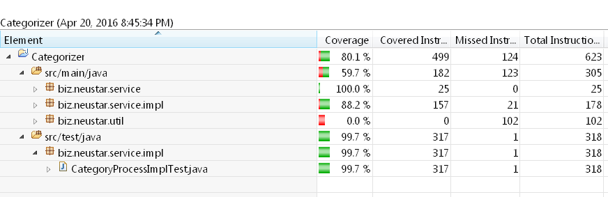

# Categorizer

Expects a file name as an arugument, Reads and process the file content based on the categories and their associated sub-categories.

### Prerequisites:

1. Java version greater than or equal 1.8

### External libraries used : 
1. junit-4.12.jar
2. commons-collections-3.2.1.jar
3. commons-lang3-3.3.2.jar
4. hamcrest-core-1.3.jar

### Algorithm:

1. Read each line from the file and add it to a set.
2. Remove from set if duplicate combination of category and sub-category exist.
3. Remove from set if any category has no associated sub-category.
4. Remove from set if any Unauthorized category entry exist.
5. Add sub-categories as a value to a pre-populated map for the associated key
6. Print the Map's key and the value size to the console.
7. Print the unique contents of set to the console.

### How to run:

1. Run from the IDE 
     Run as java application CategoryProcessLauncher by passing the filename as argument  
     Example: category.txt
 
####File Input:
- PERSON Bob Jones
- PLACE Washington
- PERSON Mary
- COMPUTER Mac
- PERSON Bob Jones
- OTHER Tree
- ANIMAL Dog
- PLACE Texas
- FOOD Steak
- ANIMAL Cat

####Output:
Category	Count  
PERSON	    2  
PLACE	    2  
ANIMAL	    2  
COMPUTER	1  
OTHER	    1   

PERSON Bob Jones  
PLACE Washington  
PERSON Mary  
COMPUTER Mac  
OTHER Tree  
ANIMAL Dog  
PLACE Texas  
ANIMAL Cat  

###Code Coverage:
Installed Jacoco plugin in Eclipse, and right click on CategoryProcessImplTest.java file Coverage As Junit Test. and got the below report.  
   
   

###PMD: 
Installed PMD plugin in Eclipse, and right click on project-> PMD -> Check Code.and not found any critical violations.
 